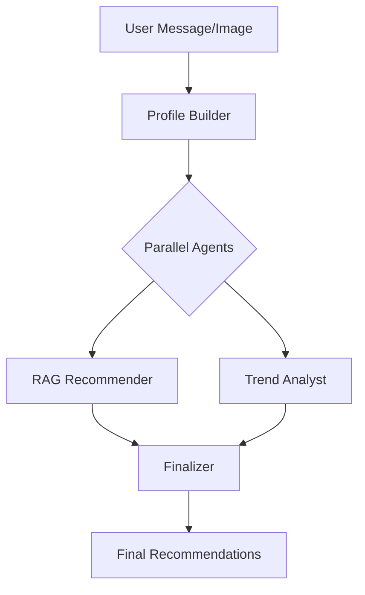

# Design Document: Culinary Trend Agent

This document outlines the design philosophy, architectural components, and technical decisions behind the Culinary Trend Agent.

## 🏛️ Architecture Overview

The system is built as a **Sequential Agent Pipeline**, allowing for specialized processing at each stage of the user interaction.

### 1. Profile Builder Agent
- **Responsibility**: distill the "User Taste Profile".
- **Inputs**: Chat history, current message, and optional image.
- **Mechanism**: Use Gemini Vision for image analysis and text extraction. It classifies favorite cuisines, price sensitivities, and dietary restrictions.

### 2. RAG Recommender (Retrieval Augmented Generation)
- **Responsibility**: Fetch hard-data candidates.
- **Mechanism**: Performs vector search against a local restaurant database.
- **Scoring**: Uses a combination of cosine similarity (vector score) and a weighted business heuristic. The top 20 candidates are re-ranked based on profile alignment (Price match, Cuisine match, Neighborhood proximity).
- **Weighting**:
    - **Cuisine**: 40% (Primary relevance)
    - **Price**: 30% (Budget adherence)
    - **Ambiance**: 20% (Vibe compatibility)
    - **Dietary**: 10% (Critical safety/preference)

### 3. Trend Analyst Agent
- **Responsibility**: Inject real-time context.
- **Mechanism**: Uses Google Search grounding to identify current culinary trends in the user's specific neighborhoods or cuisines.

### 4. Finalizer Agent
- **Responsibility**: Synthesis and Presentation.
- **Mechanism**: Orchestrates the outputs of the previous agents into a cohesive, friendly, and ranked set of recommendations with detailed "Why it matches" logic.

## 🛠️ Technical Stack

- **Frontend**: React 19, Vite 6, Tailwind CSS.
- **Animations**: `motion/react` (v12) for smooth transitions and skeleton shimmering.
- **Backend**: Node.js (Express) with `tsx` runtime.
- **AI Engine**: Google Gemini API via `@google/genai`.
- **Database (Vector)**: Custom in-memory vector DB with persistence to `vector_index.json`.
- **Cache**: SQLite-powered `embeddings_cache.db` to minimize API latency and costs.
- **Security**: Strict Origin CORS (Localhost) + JSON Content-Type Enforcement.

## 🛡️ Design Principles

### Resilience & Reliability
- **Exponential Backoff**: Implementation of `withRetry` on all model calls to handle rate limits (429s).
- **Graceful Degradation**: If the Trend Analyst fails, the system falls back to pure RAG recommendations without breaking the UI.
- **Deterministic Prompts**: Using rigid Zod schemas and explicit JSON stringification to ensure the LLM receives clean, unambiguous data structures.

### UX & Interaction Design
- **Perceived vs. Actual Performance**: Use of skeleton screens to keep the user engaged during the 2-5 second multi-agent loop.
- **Contextual Feedback**: Users can "Like/Dislike" specific recommendations, which directly influences the `UserTasteProfile` in the next turn.
- **Neighborhood-Aware**: Explicit detection and prioritization of NYC neighborhoods to ground recommendations in reality.

### 4. Design Aesthetics: "Premium Culinary Gold"

The application uses a high-end visual system designed to feel like a private concierge:
- **Palette**: Deep Charcoal (`#121212`), Culinary Gold (`#d4af37`), and Soft Cream (`#fdfcf0`).
- **Glassmorphism**: Headers, footers, and assistant bubbles use `backdrop-blur-3xl` and semi-transparent borders to create depth.
- **Typography**: Playfair Display (Serif) for headings to convey elegance; Inter (Sans) for high body text legibility.
- **Micro-Animations**: Shimmer skeletons for loading states and scale-hover effects on recommendation cards.

### 5. Rationale Architecture

The system uses a "Dual-Rationale" approach to maximize transparency:
1. **Heuristic Rationale (`whyMatch`)**: Generated by the `scoreRestaurant` skill based on hard constraints (cuisine, price, location). This is preserved through the re-ranking phase.
2. **Generative Rationale (`rationale`)**: Synthesized by the Finalizer Agent to provide a friendly, narrative explanation that connects trends and profile nuances.

## 💾 Data Strategy

- **Static Ingestion**: The restaurant database is ingested on the first run. Embeddings are cached indefinitely to prevent redundant computation.
- **Volatile Index**: The vector index is rebuilt from the cache on startup to ensure high-speed proximity searches.
- **Sanitized History**: Only the last 10 exchanges are sent to the agents to prevent prompt injection and context window pollution.
