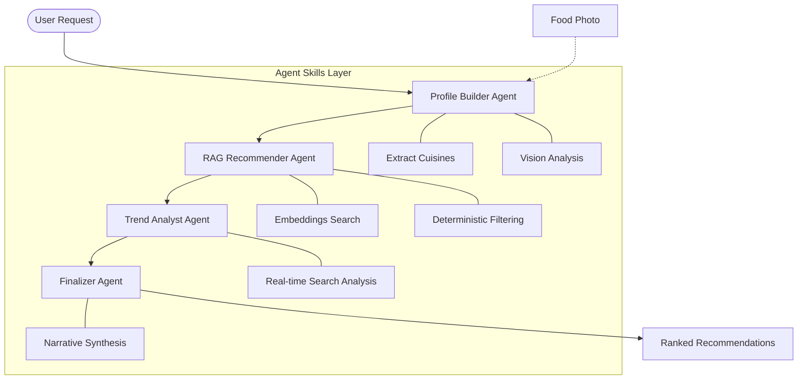

# DineAI: Architecture & Design Philosophy

DineAI is a production-grade AI application built on the principle of **Modular Agent Orchestration**. This document details the system design, data flow, and architectural decisions that ensure scalability, safety, and explainability.

## 🏛️ System Architecture

DineAI follows a sequential multi-agent pipeline where specialized agents process information through a unified state.



---

## 🤖 Core Agent Definitions & Pipeline

### 1. Profile Builder Agent

* **Responsibility**: Constructs and updates the `UserTasteProfile` state.
* **Inputs**: Raw text prompt, previous conversation history (up to 10 exchanges), and optional image metadata.
* **Outputs**: Updated `UserTasteProfile` schema.
* **Differentiator**: Distinguishes between "long-term preferences" (e.g., vegan, gluten-free) and "immediate cravings" (e.g., late-night comfort food) using temporal weighting.

### 2. RAG Recommender Agent

* **Responsibility**: Retrieves candidate restaurants from local storage using semantic similarity and enforces deterministic heuristics.
* **Inputs**: `UserTasteProfile` from the pipeline state.
* **Outputs**: Array of filtered candidate restaurant objects.
* **Constraint Handling**: Hard filters (dietary restrictions, location radius, budget caps) are executed via relational queries before applying soft semantic similarity scoring.

### 3. Food Trend Analyst Agent

* **Responsibility**: Grounds the static database recommendations in real-world reality via web search APIs.
* **Inputs**: Array of candidate restaurant names and geographic locations.
* **Outputs**: Trending signals, recent closures, viral dishes, or menu updates appended to the candidate objects.
* **Synergy**: Identifies viral dishes or new openings that overlap with the user's inferred tastes, flagging and removing permanently closed venues.

### 4. Recommendation Finalizer Agent

* **Responsibility**: Final ranking execution and narrative synthesis.
* **Inputs**: Enriched candidate restaurant data and historical user engagement metrics.
* **Outputs**: Final payload consisting of ranked recommendations, heuristic match metrics, and narrative text.
* **Narrative Rationale**: Generates a unified, natural language summary connecting all previous agent findings (e.g., *"We chose X because your profile shows a love for sourdough, and Trend Analyst confirms their new summer menu is trending for it."*).

---

## 🎨 Design Philosophy: "Premium Culinary Gold"

The UI design shifts away from utility-first directory interfaces toward an "AI Concierge" experience.

### Visual Identity

* **Color Palette**: Deep Charcoal (`#121212`) provides the luxury backdrop, accented by "Culinary Gold" (`#D4AF37`) for highlights, CTA components, and system states.
* **Glassmorphism**: Component containers utilize high-refraction blurs (`backdrop-blur-3xl`, `background: rgba(18, 18, 18, 0.6)`) to signify a premium AI engine.
* **Typography**: Dual-typeface system. Playfair Display (Serif) for headings to communicate elegance; Inter (Sans-Serif) for UI data, system logs, and general readability.

### User Experience (UX)

* **Voice-to-Text Integration**: Hands-free interaction powered by the Web Speech API allows users to dictate preferences naturally, enhancing accessibility and convenience.
* **Perceived Performance**: Shimmer skeletons map directly to the active agent step to eliminate perceived latency during the multi-second execution pipeline.
* **Dual-Rationale Layout**: Every recommendation card displays a split-view detail pane:
* **Heuristic Match**: Quantitative breakdown (e.g., *98% Match based on Location + Dietary alignment*).
* **Narrative Connection**: Qualitative story-based explanation.


---

## 💾 Data Strategy & State Management

### Unified State Schema

The single source of truth passed across the orchestrator pipeline is structured as follows:

```json
{
  "sessionId": "string (UUIDv4)",
  "userTasteProfile": {
    "longTermPreferences": ["string"],
    "immediateCravings": ["string"],
    "dietaryRestrictions": ["string"],
    "excludedIngredients": ["string"]
  },
  "context": {
    "currentLocation": {"lat": "number", "lng": "number"},
    "timestamp": "string (ISO 8601)"
  },
  "candidates": []
}

```

### Retrieval Architecture

To achieve sub-millisecond similarity search without cloud database overhead, DineAI employs a tiered hybrid storage layer:

| Component | Technology | Purpose |
| --- | --- | --- |
| **In-Memory Store** | Memory-mapped JSON Array | Sub-millisecond vector similarity search ($O(N)$ brute-force or localized graph index). |
| **Embeddings Cache** | SQLite (`embeddings_cache.db`) | Local key-value cache mapping raw text blocks to vectors. Prevents redundant API consumption costs during ingest. |
| **Metadata Index** | SQLite relational tables | Fast execution of deterministic hard filters (e.g., `WHERE open_now = 1 AND vegan = 1`). |
| **Vector Generation** | `text-embedding-004` | Generates 768-dimensional dense vector representations. |

---

## 🛡️ Security, Privacy & Guardrails

1. **Origin Isolation**: Strict Cross-Origin Resource Sharing (CORS) policies restrict API access strictly to designated, trusted domain origins.
2. **Key Protection**: Zero client-side LLM orchestration. All API keys, database credentials, and model endpoints reside in secure server-side environment variables (`process.env`).
3. **Payload Sanitization & Validation**:
* **Inbound**: Multi-layer `Zod` validation schemas sanitize all user inputs before ingestion into the pipeline.
* **Prompt Injection Mitigation**: Strict system prompting, input string escaping, and LLM-based preprocessing filters separate untrusted user input from structural instructions.


4. **Data Minimization**: Conversation history is truncated via a sliding window restricted to the last 10 exchanges. This limits PII exposure and caps token window overhead.
5. **Content Guardrails**: Output data validation layers scan the generated recommendations to ensure no toxic, off-topic, or non-culinary content is returned to the client application.

---

## 🛑 Error Handling & Resiliency Strategy

To ensure high availability in production, the application implements the following fallback protocols:

* **Upstream Model Failures**: If the main model encounters rate limits or downtime, the orchestration pipeline transparently falls back to a secondary high-throughput LLM model instance.
* **Search API Failout**: If the web search provider for the Food Trend Analyst Agent fails or times out (capped at 1500ms), the pipeline skips the trend enrichment step entirely and relies exclusively on the deterministic local database to deliver results.
* **State Recovery**: Session states are automatically saved to an encrypted local Redis cache instance. If a network disconnection happens mid-pipeline, the application can recover the precise state without re-running the initial profiling steps.
