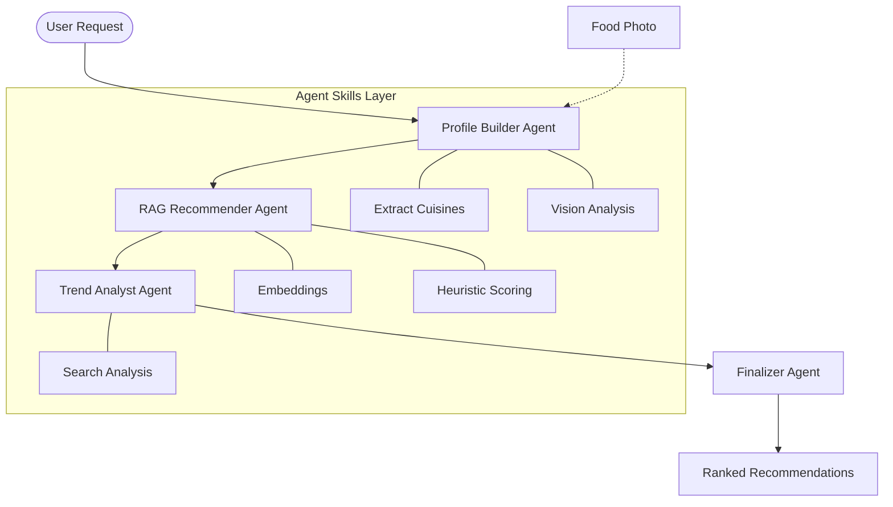

# DineAI: Architecture & Design Philosophy

DineAI is a production-grade AI application built on the principle of **Modular Agent Orchestration**. This document details the system design, data flow, and architectural decisions that ensure scalability and explainability.

## 🏛️ System Architecture

DineAI follows a sequential multi-agent pipeline where specialized agents process information through a unified state.

## 🤖 Core Agent Definitions

### 1. Profile Builder Agent
- **Responsibility**: Constructs the `UserTasteProfile` by merging conversation history and image-based signals.
- **Differentiator**: It distinguishes between "long-term preferences" and "immediate cravings" to ensure context-aware results.

### 2. RAG Recommender Agent
- **Responsibility**: Retrieves candidate restaurants using semantic similarity and deterministic heuristics.
- **Constraint Handling**: It strictly enforces dietary restrictions and neighborhood preferences before passing candidates to the finalizer.

### 3. Food Trend Analyst Agent
- **Responsibility**: Grounding the recommendations in real-world reality via Google Search.
- **Synergy**: It identifies viral dishes or new openings that overlap with the user's inferred tastes.

### 4. Recommendation Finalizer Agent
- **Responsibility**: Narrative synthesis and final ranking.
- **Output**: Generates the "Narrative Rationale" that connects all previous agent findings into a human-friendly suggestion.

---

## 🎨 Design Philosophy: "Premium Culinary Gold"

The UI design is optimized for high-end user engagement, moving away from utility-first interfaces toward an "AI Concierge" experience.

### Visual Identity
- **Color Palette**: Deep Charcoal (`#121212`) provides a luxury backdrop, accented by "Culinary Gold" (`#d4af37`).
- **Glassmorphism**: Components use high-refraction blurs (`backdrop-blur-3xl`) to signify a sophisticated, modern AI engine.
- **Typography**: Dual-typeface system using Serif for elegance and Sans-Serif for clarity.

### User Experience (UX)
- **Immediate Feedback**: Shimmer skeletons prevent perceived latency during the multi-second agent pipeline.
- **Dual-Rationale**: Every card displays both a **Heuristic Match** (logic-based) and a **Narrative Connection** (story-based).

---

## 💾 Data Strategy & Vector DB

### Semantic Retrieval
DineAI uses a custom, in-memory **LocalVectorDB** for sub-millisecond similarity search.
- **Embeddings**: Pre-computed using `gemini-embedding-2-preview`.
- **Persistence**: Index is saved to `vector_index.json` at runtime, while a SQLite-based `embeddings_cache.db` prevents redundant API usage during ingestion.

### State Management
The "Truth" for each user is the `UserTasteProfile`. This state is:
- **Evolving**: Refined after every message.
- **Feedback-Driven**: Explicitly updated when users "Like" or "Dislike" a restaurant.

---

## 🛡️ Security & Privacy Standards

1. **Origin Isolation**: Strict CORS policies ensure the API is only accessible from the authorized frontend.
2. **Key Protection**: All AI execution happens server-side. No client-side exposure of API keys.
3. **Payload Sanitization**: Multi-layer Zod validation prevents malformed data or prompt injection attempts from entering the agent pipeline.
4. **Data Minimization**: Conversation history is truncated to the last 10 exchanges, reducing PII exposure and managing context window costs.
